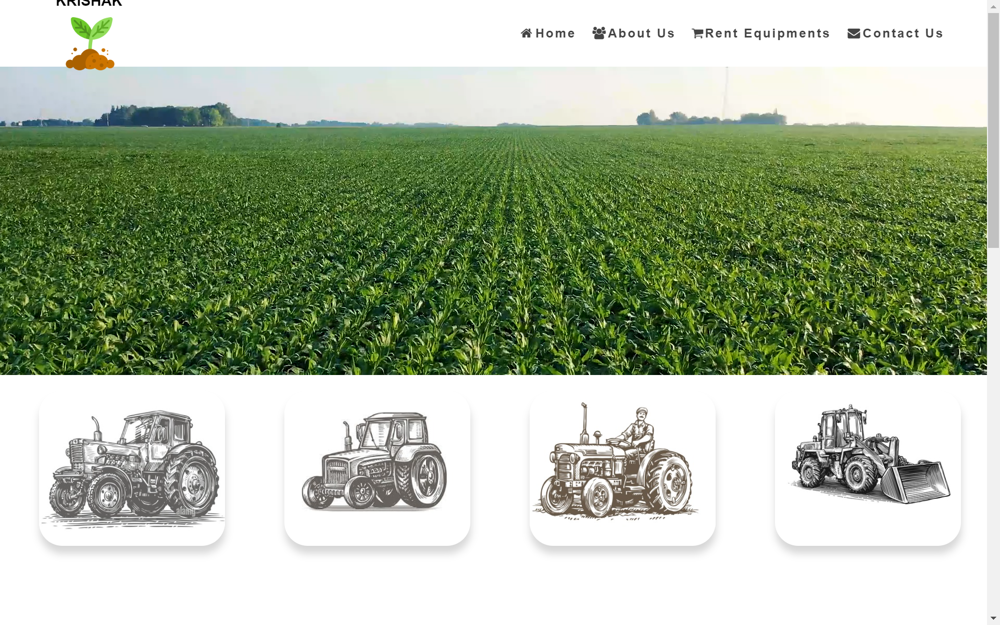
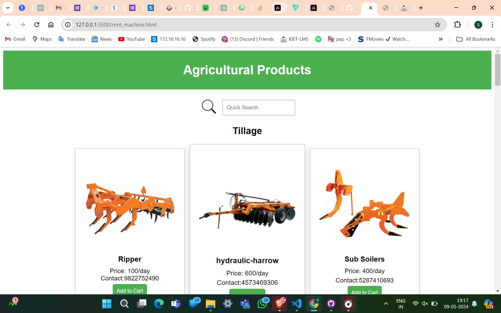

# Krishak
Krishak: A farmer-friendly platform for renting farming tools. Frontend: React, Redux. Backend: Django Rest Framework. Tools: VS Code, Figma, Canva, Postman, Swagger, Git, Python, Jupyter, PostgreSQL.

